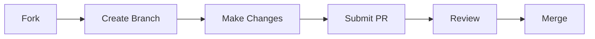

# <div align="center">CardioSense 🫀</div>

<div align="center">

[](https://vphkvnvgykbobebausb62v.streamlit.app/#da35274d)
[](https://python.org)
[](https://github.com)
[](https://github.com/AryanSONI00/CardioSense-/commits/main)
[](https://github.com/AryanSONI00/CardioSense-/stargazers)

<a href="https://vphkvnvgykbobebausb62v.streamlit.app/#da35274d">
  
</a>

### 🔴 [Try Live Demo](https://vphkvnvgykbobebausb62v.streamlit.app/#da35274d)

</div>

<hr>

## 🌟 About CardioSense

CardioSense is an advanced AI-powered health tool that leverages machine learning to predict heart disease risk. Using state-of-the-art algorithms and medical-grade parameters, it provides instant, personalized risk assessments through an intuitive interface.

<details>
<summary>✨ Key Features</summary>

<br>

-   🎯 **Accurate Prediction** - Advanced KNN algorithm for reliable risk assessment
-   📊 **Real-time Analysis** - Instant results with probability scores
-   🔄 **Interactive Interface** - User-friendly design for easy data input
-   📈 **Visual Results** - Clear probability display with risk indicators
-   🏥 **Medical Parameters** - Comprehensive health metrics analysis
-   🤖 **ML-Powered** - Sophisticated machine learning backend
-   🔒 **Privacy Focused** - No data storage, instant processing

</details>

## 🛠️ Technology Stack

<div align="center">


</div>

## 📊 Health Parameters

<table align="center">
  <tr>
    <th>Category</th>
    <th>Parameters</th>
    <th>Description</th>
  </tr>
  <tr>
    <td>👤 Personal</td>
    <td>Age, Sex</td>
    <td>Basic demographic information</td>
  </tr>
  <tr>
    <td>🩺 Clinical</td>
    <td>Blood Pressure, Cholesterol</td>
    <td>Key health indicators</td>
  </tr>
  <tr>
    <td>😣 Symptoms</td>
    <td>Chest Pain Type, Exercise Angina</td>
    <td>Physical manifestations</td>
  </tr>
  <tr>
    <td>💓 Cardiac</td>
    <td>Maximum Heart Rate</td>
    <td>Heart performance metrics</td>
  </tr>
</table>

## 🚀 Getting Started

<details>
<summary>Installation Steps</summary>

<br>

1. **Clone the Repository**

```bash
git clone https://github.com/AryanSONI00/CardioSense-.git
cd CardioSense-
```

2. **Set Up Environment**

```bash
python -m venv venv
source venv/bin/activate  # On Windows: venv\Scripts\activate
```

3. **Install Dependencies**

```bash
pip install -r requirements.txt
```

4. **Train the Model**

```bash
python heart_disease_knn.py
```

5. **Launch the App**

```bash
streamlit run heart_disease_app.py
```

</details>

## 📸 Application Preview

<div align="center">
  
  <p><i>Real-time heart disease risk assessment in action</i></p>
</div>

## 🎯 Model Details

<details>
<summary>Technical Specifications</summary>

<br>

-   **Algorithm**: K-Nearest Neighbors (KNN)

    -   Non-parametric learning
    -   Pattern recognition based
    -   Distance-weighted voting

-   **Features**: 7 carefully selected health indicators

    -   Standardized scaling
    -   Categorical encoding
    -   Numerical normalization

-   **Validation**:
    -   Cross-validation
    -   Performance metrics
    -   Error analysis

</details>

## 🤝 Contribution Guidelines

We welcome contributions! Here's how you can help:



## ⚠️ Medical Disclaimer

<div align="center">

**This tool is for educational purposes only.**
Not a substitute for professional medical advice, diagnosis, or treatment.
Always consult qualified healthcare providers for medical decisions.

</div>

## 🌟 Support the Project

If you find CardioSense helpful, consider:

-   ⭐ Starring the repository
-   🐛 Reporting issues
-   🤝 Contributing to the code
-   📢 Sharing with others

---

<div align="center">
  <h3>Developed by Aryan Soni</h3>
  <p>
    <a href="https://github.com/AryanSONI00">
      
    </a>
    <a href="www.linkedin.com/in/aryan-soni-604696252">
      
    </a>
  </p>
</div>
